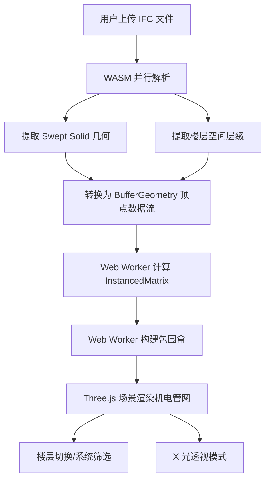

## 1. 产品概述

建筑机电管线综合审查平台（BIM MEP Clash）是一款面向建筑工程师的 WebGL 三维可视化工具，旨在解决超大体量 IFC 建筑模型的前端解析与机电管线碰撞审查难题。通过 Rust→WASM 并行解析引擎与 Three.js 离屏渲染架构，实现毫秒级 Swept Solid 几何提取与百万级顶点管网的实时透视浏览。

- 目标用户：建筑机电工程师、BIM 协调员、暖通/给排水/电气设计师
- 核心价值：在浏览器中完成超大 IFC 模型的解析与机电管线三维审查，无需安装桌面软件

## 2. 核心功能

### 2.1 用户角色

| 角色 | 使用方式 | 核心权限 |
|------|----------|----------|
| BIM 工程师 | 直接访问网页 | 上传 IFC 文件、查看三维模型、切换楼层与系统 |
| 机电协调员 | 直接访问网页 | 碰撞定位、X 光透视、导出碰撞报告 |

### 2.2 功能模块

1. **模型加载页**：IFC 文件上传、WASM 解析进度、几何数据转换状态
2. **三维审查工作台**：Three.js 场景渲染、楼层切换、机电系统筛选、X 光透视模式

### 2.3 页面详情

| 页面名称 | 模块名称 | 功能描述 |
|----------|----------|----------|
| 模型加载页 | 文件上传区 | 拖拽/点击上传 IFC 文件，显示文件大小与名称 |
| 模型加载页 | 解析进度面板 | WASM 解析进度条、Swept Solid 提取数量、楼层空间层级树预览 |
| 模型加载页 | 几何转换状态 | BufferGeometry 顶点数据流生成进度、内存占用指示 |
| 三维审查工作台 | Three.js 场景 | OrbitControls 交互、HVAC/桥架/水管三维渲染 |
| 三维审查工作台 | 楼层导航 | 左侧楼层空间层级树，点击定位到对应楼层 |
| 三维审查工作台 | 系统筛选器 | HVAC/桥架/水管分类切换，支持多选 |
| 三维审查工作台 | X 光透视模式 | 半透明材质切换，透视墙体内隐藏管网 |
| 三维审查工作台 | 性能监控 | FPS 计数器、Web Worker 计算状态指示 |

## 3. 核心流程

用户上传 IFC 文件 → WASM 模块并行解析 IFC 数据 → 提取 Swept Solid 几何与楼层空间层级 → 转换为 BufferGeometry 顶点数据流 → Web Worker 离屏计算 InstancedMatrix 与包围盒 → Three.js 场景加载机电管网模型 → 用户切换楼层/系统/透视模式进行审查

## 4. 用户界面设计

### 4.1 设计风格

- 主色调：深色工业风（#0D1117 深空灰 + #00D4AA 霓虹青绿 + #FF6B35 警示橙）
- 次色调：#1C2333 面板灰、#2D3548 卡片灰、#4A9EFF 科技蓝
- 按钮风格：圆角矩形、微发光边框、hover 时发光增强
- 字体：JetBrains Mono（数据/代码）、Noto Sans SC（中文界面）
- 布局风格：左侧面板 + 中央3D视口 + 底部状态栏
- 图标风格：线性图标（Lucide）、霓虹青绿色强调

### 4.2 页面设计概览

| 页面名称 | 模块名称 | UI 元素 |
|----------|----------|----------|
| 模型加载页 | 文件上传区 | 深色拖拽区、虚线边框、中心上传图标、霓虹青绿高亮 |
| 模型加载页 | 解析进度面板 | 圆形进度环、Swept Solid 计数动画、楼层树预览 |
| 三维审查工作台 | Three.js 视口 | 全屏3D画布、深色背景、网格地面、环境光 |
| 三维审查工作台 | 左侧面板 | 楼层树形列表、系统筛选复选框、透明度滑块 |
| 三维审查工作台 | 工具栏 | 顶部悬浮工具条、X光模式切换、重置视图按钮 |
| 三维审查工作台 | 状态栏 | 底部FPS计数、Worker状态指示、内存占用 |

### 4.3 响应式策略

- 桌面优先设计，最低分辨率 1280×720
- 3D 视口自适应容器尺寸，面板可折叠
- 大屏（≥1920px）展开所有面板，中屏折叠左侧面板为图标

### 4.4 3D 场景指引

- 环境/HDRI：深色工业场景，微弱环境光（#1a1a2e）
- 灯光设置：半球光（HemisphereLight 天顶#4A9EFF/地面#0D1117）+ 方向光（DirectionalLight 暖白）
- 相机设置：PerspectiveCamera 60° FOV，初始俯视 45° 角，OrbitControls 自由旋转
- 构图与焦点：建筑模型居中，管网系统高亮，墙体半透明
- 交互与动画：鼠标悬停管线高亮、点击弹出属性面板、X光模式平滑过渡
- 后处理效果：Bloom 发光（高亮管线）、SAO 环境遮蔽
- 资源来源与性能预算：目标 60FPS，Web Worker 异步计算避免主线程阻塞
