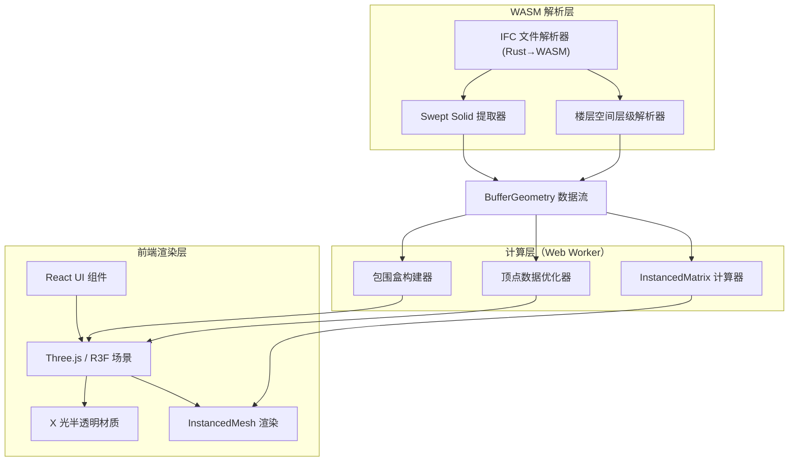
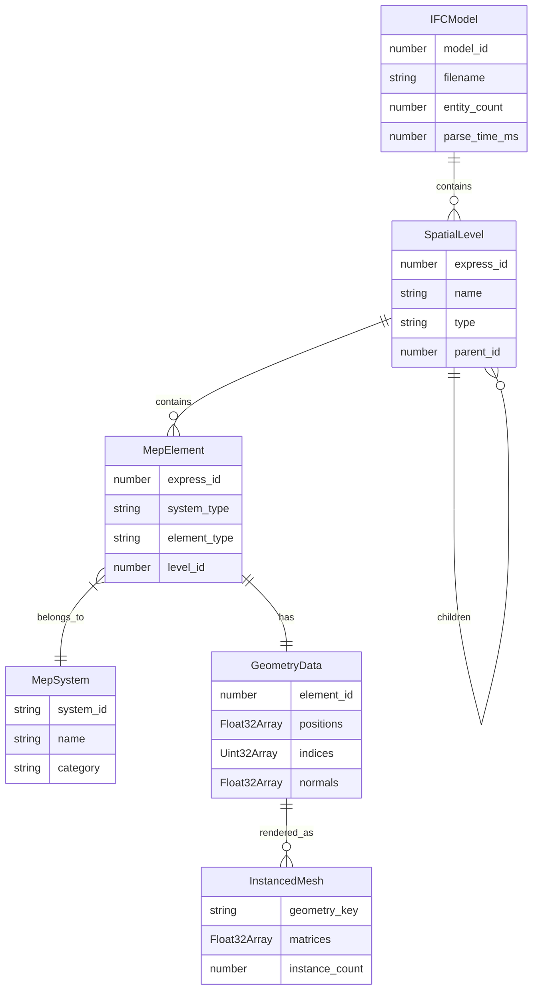

## 1. 架构设计



## 2. 技术说明

- 前端：React@18 + TypeScript + Tailwind CSS + Vite
- 3D 渲染：three + @react-three/fiber + @react-three/drei + @react-three/postprocessing
- 状态管理：zustand
- WASM 集成：@wasm-tool/plugin（Vite WASM 加载）+ 自定义 Rust→WASM glue code
- Web Worker：Comlink（简化 Worker 通信）+ 自定义 Worker 池
- 初始化工具：vite-init（react-ts 模板）
- 后端：无（纯前端应用）
- 数据库：无（本地文件处理）

## 3. 路由定义

| 路由 | 用途 |
|------|------|
| / | 模型加载页：IFC 文件上传与解析 |
| /viewer | 三维审查工作台：Three.js 场景渲染与机电管线审查 |

## 4. API 定义

无后端 API。所有数据在浏览器本地处理。

### 4.1 WASM 接口定义

```typescript
interface IfcWasmModule {
  parse(buffer: ArrayBuffer): IfcParseResult;
  extract_swept_solids(modelId: number): SweptSolidData[];
  extract_spatial_hierarchy(modelId: number): SpatialNode[];
  get_geometry_vertices(modelId: number, expressId: number): Float32Array;
  get_geometry_indices(modelId: number, expressId: number): Uint32Array;
  free_model(modelId: number): void;
}

interface IfcParseResult {
  model_id: number;
  entity_count: number;
  geometry_count: number;
  parse_time_ms: number;
}

interface SweptSolidData {
  express_id: number;
  type: string;
  profile: Float32Array;
  direction: Float32Array;
  length: number;
}

interface SpatialNode {
  express_id: number;
  name: string;
  type: string;
  children: SpatialNode[];
  bounding_box: { min: [number, number, number]; max: [number, number, number] };
}
```

### 4.2 Web Worker 接口定义

```typescript
interface GeometryWorkerApi {
  computeInstancedMatrices(
    instances: InstanceData[],
    baseGeometry: VertexData
  ): Float32Array;
  computeBoundingBoxes(
    geometries: VertexData[]
  ): BoundingBox[];
  optimizeVertexData(
    positions: Float32Array,
    indices: Uint32Array
  ): OptimizedGeometry;
}

interface InstanceData {
  position: [number, number, number];
  rotation: [number, number, number];
  scale: [number, number, number];
}

interface VertexData {
  positions: Float32Array;
  indices: Uint32Array;
}

interface BoundingBox {
  min: [number, number, number];
  max: [number, number, number];
  center: [number, number, number];
}

interface OptimizedGeometry {
  positions: Float32Array;
  indices: Uint32Array;
  vertex_count: number;
  index_count: number;
}
```

## 5. 服务器架构图

无后端服务。

## 6. 数据模型

### 6.1 数据模型定义



### 6.2 数据定义语言

本项目为纯前端应用，数据在内存中管理。使用 zustand store 统一管理：

```typescript
interface MepClashStore {
  ifcModel: IFCModel | null;
  spatialLevels: SpatialLevel[];
  mepElements: MepElement[];
  mepSystems: MepSystem[];
  geometryRegistry: Map<number, GeometryData>;
  instanceRegistry: Map<string, InstancedMesh>;

  selectedLevelId: number | null;
  selectedSystemIds: string[];
  xrayMode: boolean;
  opacity: number;

  setIfcModel: (model: IFCModel) => void;
  setSpatialLevels: (levels: SpatialLevel[]) => void;
  addMepElements: (elements: MepElement[]) => void;
  setSelectedLevel: (id: number | null) => void;
  toggleSystem: (systemId: string) => void;
  setXrayMode: (enabled: boolean) => void;
  setOpacity: (value: number) => void;
}
```
